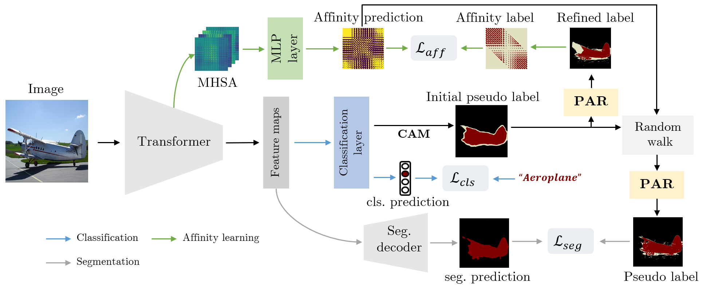

## Learning Affinity from Attention: End-to-End Weakly-Supervised Semantic Segmentation with Transformers

Code of CVPR 2022 paper: Learning Affinity from Attention: End-to-End Weakly-Supervised Semantic Segmentation with Transformers.

[[arXiv]](https://arxiv.org/abs/2203.02664) [[Project]](https://rulixiang.github.io/afa) [[Poster]]()

<div align="center">

<br>
  
</div>

## Abastract

> Weakly-supervised semantic segmentation (WSSS) with image-level labels is an important and challenging task. Due to the high training efficiency, end-to-end solutions for WSSS have received increasing attention from the community. However, current methods are mainly based on convolutional neural networks and fail to explore the global information properly, thus usually resulting in incomplete object regions. In this paper, to address the aforementioned problem, we introduce Transformers, which naturally integrate global information, to generate more integral initial pseudo labels for end-to-end WSSS. Motivated by the inherent consistency between the self-attention in Transformers and the semantic affinity, we propose an Affinity from Attention (AFA) module to learn semantic affinity from the multi-head self-attention (MHSA) in Transformers. The learned affinity is then leveraged to refine the initial pseudo labels for segmentation. In addition, to efficiently derive reliable affinity labels for supervising AFA and ensure the local consistency of pseudo labels, we devise a Pixel-Adaptive Refinement module that incorporates low-level image appearance information to refine the pseudo labels. We perform extensive experiments and our method achieves 66.0% and 38.9% mIoU on the PASCAL VOC 2012 and MS COCO 2014 datasets, respectively, significantly outperforming recent end-to-end methods and several multi-stage competitors. Code will be made publicly available.

## Preparations

### VOC dataset

#### 1. Download

``` bash
wget http://host.robots.ox.ac.uk/pascal/VOC/voc2012/VOCtrainval_11-May-2012.tar
tar –xvf VOCtrainval_11-May-2012.tar
```
#### 2. Download the augmented annotations
The augmented annotations are from [SBD dataset](http://home.bharathh.info/pubs/codes/SBD/download.html). Here is a download link of the augmented annotations at
[DropBox](https://www.dropbox.com/s/oeu149j8qtbs1x0/SegmentationClassAug.zip?dl=0). After downloading ` SegmentationClassAug.zip `, you should unzip it and move it to `VOCdevkit/VOC2012`. The directory sctructure should thus be 

``` bash
VOCdevkit/
└── VOC2012
    ├── Annotations
    ├── ImageSets
    ├── JPEGImages
    ├── SegmentationClass
    ├── SegmentationClassAug
    └── SegmentationObject
```

### COCO dataset

#### 1. Download
``` bash
wget http://images.cocodataset.org/zips/train2014.zip
wget http://images.cocodataset.org/zips/val2014.zip
```
After unzipping the downloaded files, for convenience, I recommand to organizing them in VOC style.

``` bash
MSCOCO/
├── JPEGImages
│    ├── train
│    └── val
└── SegmentationClass
     ├── train
     └── val
```

#### 2. Generating VOC style segmentation labels for COCO
To generate VOC style segmentation labels for COCO dataset, you could use the scripts provided at this [repo](https://github.com/alicranck/coco2voc). Or, just downloading the generated masks from [Google Drive](https://drive.google.com/file/d/1pRE9SEYkZKVg0Rgz2pi9tg48j7GlinPV/view).

### Create and activate conda environment

```bash
conda create --name py36 python=3.6
conda activate py36
pip install -r requirments.txt
```

### Clone this repo

```bash
git clone https://github.com/rulixiang/afa.git
cd afa
```

### Download Pre-trained weights

Download the pre-trained weights from the official [SegFormer](https://github.com/NVlabs/SegFormer) implementation and move them to `pretrained/`.

### [Optional] Build python extension module

To use the regularized loss, you need to download and compile the python extension, which is provied [here](https://github.com/meng-tang/rloss/tree/master/pytorch#build-python-extension-module). This module is not necessary and only brings subtle improvement to the final performance on VOC according to the ablation.

### Train
To start training, just run the scripts under `launch/`.
```bash
# train on voc
bash launch/run_sbatch_attn_reg.sh
# train on coco
bash launch/run_sbatch_attn_reg_coco.sh
```
You should get the training logs by running the above commands. Also, check our training log under `logs/`.

## Results
The generated CAMs and semantic segmentation results on the DAVIS 2017 dataset. The model is trained on VOC 2012 dataset. For more results, please see the  [[Project page]](https://rulixiang.github.io/afa) or [[Paper]](https://arxiv.org/abs/2203.02664).
<div align="center">
<b>Visualization</b>. <i>Left:</i> CAMs of the cls branch. <i>Right:</i> Prediction of the seg branch.
<br>
  
  
  
</div>

## Citation
Please kindly cite our paper if you find it's helpful in your work.

``` bibtex
@inproceedings{ru2022learning,
    title = {Learning Affinity from Attention: End-to-End Weakly-Supervised Semantic Segmentation with Transformers},
    author = {Lixiang Ru and Yibing Zhan and Baosheng Yu and Bo Du}
    booktitle = {CVPR},
    year = {2022},
  }
```

## Acknowledgement

We use [SegFormer](https://github.com/NVlabs/SegFormer) and their [pre-trained weights](https://drive.google.com/drive/folders/1b7bwrInTW4VLEm27YawHOAMSMikga2Ia?usp=sharing) as the backbone, which is based on [MMSegmentation](https://github.com/open-mmlab/mmsegmentation/tree/master/configs/segformer). We heavily borrowed [1-stage-wseg](https://github.com/visinf/1-stage-wseg) to construct our PAR. Also, we use the [Regularized Loss](https://github.com/meng-tang/rloss) and the Random Walk Propagation in [PSA](https://github.com/jiwoon-ahn/psa). Many thanks to their brilliant works!
